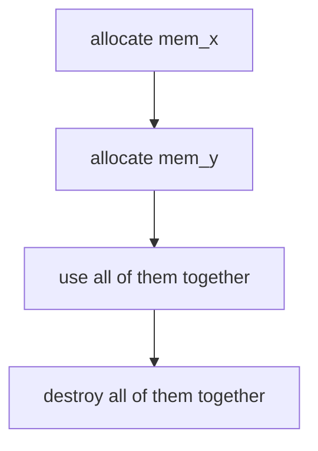
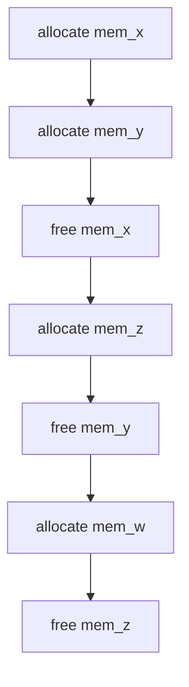

a while ago i made a simple bump allocator, built on top of `brk()` & `sbrk()`
during this i found some constraints as to why this sort of "linear 
allocation is a bad idea".
### bump allocator's mechanism
this sort of allocator starts off with a massive empty block and a single 
pointer at the very beginning. now, whenever user asks for 10 bytes it simply
provides user the *pointer* and moves the pointer 10 bytes forward. next up
they ask for 20, just return the current address and *bumps* the 
pointer 20 bytes forward.. and so on.

now standard allocators such as `malloc(size)` treat the memory block as 
structures and these structures have "hidden" metadata to them which keeps
track of the state of memory the block size, state and so on.
the main fault in a bump allocator is that, it has no concept of this 
metadata usage. 

this lack of "tracking" of state of each memory block makes the bump 
allocator _insanely_ fast. (it's just addition to current address position so
that makes the time complexity O(1) regardless of whether it's the 
first allocation or the ten thousandth).

pretty neat right? but this also ensures that there is no concept of `free()`
for individual blocks. you can't create a hole in the middle of linear 
allocated space the only thing you can do is just reset the main pointer all
the way back to zero.
this means one `bump_allocator_free()` call and the entire arena gets wiped 
out. not being able to `free()` individual chunks leads to a specific 
type of memory degradation. we call it **Temporal Fragmentation**.

some people might be fine with it but this "global" state is 
really dangerous.
the primary reason being is that `sbrk()` is a global resource.
suppose you are using sbrk() to "bump" the allocator. and then later
you call a stdlib method such as `printf()` or `std::vector` the 
program will crash and segfault.

standard library functions like `printf()`, `std::vector`, and other runtime utilities allocate memory internally through `malloc()`. the issue is that `malloc()` manages the same underlying process heap region that `sbrk()` manipulates. since `sbrk()` operates on a process wide global heap boundary, directly using
it inside a custom allocator means you are modifying memory state
that the `malloc()` also relies on. the danger is not that both allocators necessarily receive the exact same
pointer, but that both begin making independent assumptions about ownership
and layout of the same heap region.
if your allocator later rewinds or resets that region, it may destroy memory
still considered valid by `malloc()`, leading to heap corruption or 
segfault.

--- 

you get mem_a from sbrk() and the malloc call after that moves it to
mem_x position.. now if you tried to perform that "heap" wipe 
the program tries to free the mem_x which is under malloc()'s allocation and not yours! leading to segmentation fault or 
memory corruption (which is much worse)

so we've established that in a perfect universe a bump allocator
can work but the flow will be:

### the solution

to fix this `sbrk()` issue, we can use arena allocators. i won't talk
about arena allocators much but on abstract level instead of moving the break of whole program! we allocate a very huge chunk of memory at once using malloc or mmap and then treat the block itself as a "sandbox" 